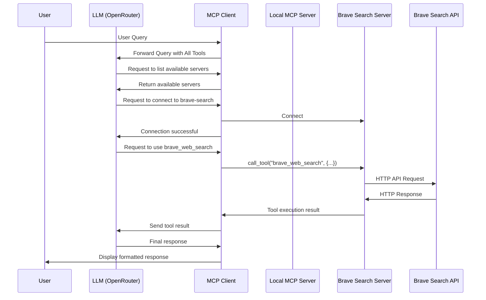

# MCP Client - Advanced Multi-Server Architecture

An advanced, modular client for interacting with Model Context Protocol (MCP) servers using OpenRouter's LLM API services. This project demonstrates a sophisticated approach to AI tool integration using direct client-to-multiple-servers communication.

## Key Features

- **Dynamic Server Connection**: LLM decides when to connect to servers based on user queries
- **Multiple Server Integration**: Connect to both local and remote MCP servers simultaneously
- **Direct Server Access**: Client connects directly to each specialized server
- **Unified Tool Interface**: Present tools from all servers to the LLM with clear server attribution
- **API Independence**: No direct API dependencies in core code - all external APIs are handled through MCP servers
- **Modular Architecture**: Clean separation between client, LLM integration, and tool management

## Architecture Overview

This project implements an advanced MCP architecture pattern that allows one client to connect to multiple specialized MCP servers as needed:

```
                          ┌───────────────────────┐
                     ┌───►│  Local MCP Server     │
                     │    │  (Math, Health tools) │
                     │    └───────────────────────┘
┌─────────────┐      │    
│             │      │    ┌───────────────────────┐       ┌─────────────┐
│  LLM Client ├──────┼───►│  Brave Search Server  │──────►│  Brave API  │
│ (OpenRouter)│      │    │                       │       │             │
│             │      │    └───────────────────────┘       └─────────────┘
└─────────────┘      │    
                     │    ┌───────────────────────┐
                     └───►│  Other MCP Servers    │
                          │  (As needed)          │
                          └───────────────────────┘
```

### Components

1. **Client Components**
   - `main.py`: Entry point for the application
   - `src/client/mcp_client.py`: Main client for interacting with MCP servers
   - `src/client/llm_client.py`: Client for communicating with the OpenRouter API
   - `src/client/tool_manager.py`: Manages tool operations and formatting
   - `src/utils/logger_setup.py`: Configures logging for the application

2. **Server Components**
   - `server/main.py`: Entry point for the local MCP server
   - `server/tools/`: Directory containing tool implementations
   - `server/resources/`: Directory containing resource implementations
   - `server/prompts/`: Directory for prompt templates
   - `server/utils/`: Utility functions shared across modules

3. **External MCP Servers**
   - `@modelcontextprotocol/server-brave-search`: Official Brave Search MCP server
   - Additional servers as needed (defined in `server_config.json`)

## Setup

1. **Install dependencies**:
   ```bash
   pip install -r requirements.txt
   ```

2. **Create a `.env` file** with your API keys:
   ```
   OPENROUTER_API_KEY=your-openrouter-api-key
   BRAVE_API_KEY=your-brave-api-key
   DEFAULT_LLM_MODEL=google/gemini-2.0-flash-001
   ```

3. **Ensure NPX is installed** (for external MCP servers):
   ```bash
   # Check if npx is installed
   npx --version
   
   # If not, install Node.js which includes npx
   # On Ubuntu/Debian:
   sudo apt update && sudo apt install nodejs npm
   ```

## Usage

### Dynamic Server Connection (New Default)

The simplest way to use the client is with dynamic server connection. The LLM will automatically connect to servers as needed based on your queries:

```bash
# Start with dynamic server connection
python main.py
```

With this approach, the LLM will:
1. Show you what servers are available
2. Connect to appropriate servers when your queries require specific tools
3. Provide feedback when it connects to servers

### Pre-connecting to Servers (Optional)

You can also pre-connect to specific servers at startup if desired:

```bash
# Pre-connect to local server script
python main.py server/main.py

# Pre-connect to configured server from server_config.json
python main.py --server brave-search

# Pre-connect to multiple servers
python main.py server/main.py --server brave-search
```

Even when pre-connected to some servers, the LLM can still connect to additional servers dynamically as needed.

### Server Configuration

External MCP servers are defined in `server_config.json`:

```json
{
  "brave-search": {
    "command": "npx",
    "args": ["-y", "@modelcontextprotocol/server-brave-search"],
    "env": {
      "BRAVE_API_KEY": "${BRAVE_API_KEY}"
    }
  },
  "another-server": {
    "command": "path/to/server",
    "args": ["--option", "value"],
    "env": {
      "SOME_API_KEY": "your-api-key-here"
    }
  }
}
```

## Dynamic Server Connection Workflow

Here's how the dynamic server connection works:

1. **User Query**: You ask a question
2. **LLM Analysis**: The LLM analyzes what's needed to answer your question
3. **Server Discovery**: If specialized tools are needed, the LLM checks available servers
4. **Dynamic Connection**: The LLM connects to the appropriate server(s)
5. **Tool Usage**: The LLM uses the newly available tools to answer your question

This process is completely transparent to you - you just ask your questions naturally, and the system handles finding and connecting to the right tools.

## Client-to-Multiple-Servers Communication

The client maintains separate connections to each server and routes tool calls appropriately:



## Tool Categories

The various servers provide the following tools:

1. **Local Server Tools**:
   - **Math Operations**:
     - `add`: Adds two numbers
     - `multiply`: Multiplies two numbers
   - **Health Calculations**:
     - `calculate_bmi`: Calculates BMI from weight (kg) and height (m)
   - **External Data**:
     - `fetch_weather`: Fetches weather information for a location based on coordinates
     - `fetch_next_three_fixtures`: Fetches upcoming football fixtures

2. **Brave Search Server Tools**:
   - `brave_web_search`: Performs web searches
   - `brave_local_search`: Searches for local businesses

## Example Interaction

Here's an example of dynamic server connection during a conversation:

```
Query: What's the weather like in London?

[Server management] Available servers (2): brave-search, main-server

[Server management] Successfully connected to main-server. Available tools: add, multiply, calculate_bmi, fetch_weather, fetch_next_three_fixtures

[Calling tool fetch_weather from main-server server with args {"latitude": 51.5074, "longitude": -0.1278}]
Tool result: Temperature: 12.3°C, Wind speed: 15.2 km/h, Weather code: Partly cloudy

Based on the current weather data for London, it's partly cloudy with a temperature of 12.3°C (54.1°F). The wind speed is moderate at 15.2 km/h (9.4 mph). It's a typical spring day in London - cool but not cold, with some cloud cover. You might want to bring a light jacket if you're heading out.

[Currently connected to: main-server]
```

## Adding New Tools

You can extend the server with additional tools by:

1. Adding new tool modules in the `server/tools/` directory
2. Creating new resource modules in the `server/resources/` directory
3. Implementing registration functions for your new components
4. Updating the appropriate `__init__.py` file to import and register your components

Example tool module:

```python
"""Example tool module for the MCP server."""
from mcp.server.fastmcp import FastMCP

def register_example_tools(mcp: FastMCP) -> None:
    """Register all example tools with the MCP server."""
    
    @mcp.tool()
    def example_tool(param1: str, param2: int) -> str:
        """
        Example tool description
        
        Parameters:
        -----------
        param1 : str
            Description of param1
        param2 : int
            Description of param2
            
        Returns:
        --------
        str
            Description of return value
        """
        return f"Result: {param1} - {param2}"
```

## Adding New Servers

To add a new server to the configuration:

1. Create a new entry in `server_config.json`:
   ```json
   "my-new-server": {
     "command": "your-command",
     "args": ["--arg1", "value1"],
     "env": {
       "API_KEY": "your-api-key"
     }
   }
   ```

2. The LLM will automatically detect and connect to it when needed, or you can pre-connect:
   ```bash
   python main.py --server my-new-server
   ```

## Debugging

Detailed logging is provided for debugging and development. The logs include:

- Tool execution details
- Server connection information
- LLM API requests and responses
- Error details with stack traces

To view more detailed logs, set the logging level to DEBUG in `src/utils/logger_setup.py`.

## Contributors

- [Henry Pugh](https://github.com/henrypugh)