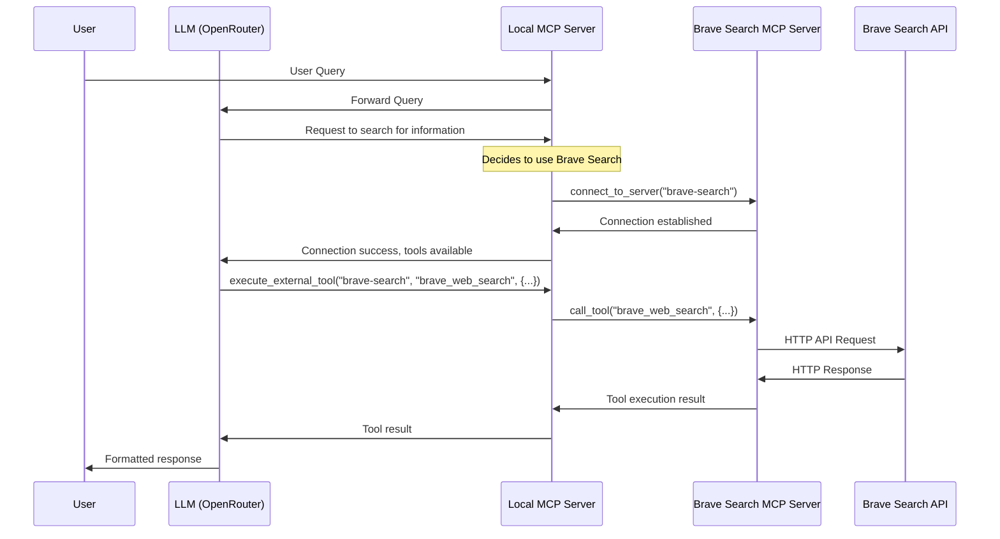

# MCP Client - Advanced Multi-Server Architecture

An advanced, modular client for interacting with Model Context Protocol (MCP) servers using OpenRouter's LLM API services. This project demonstrates a sophisticated approach to AI tool integration using MCP's server-to-server communication capabilities.


## Key Features

- **Multiple Server Integration**: Connect to both local and remote MCP servers simultaneously
- **Dynamic Server Connections**: Connect to additional MCP servers during runtime
- **Server-to-Server Communication**: Execute tools across a network of specialized servers
- **API Independence**: No direct API dependencies in core code - all external APIs are handled through MCP servers
- **Modular Architecture**: Clean separation between client, LLM integration, and tool management

## Architecture Overview

This project implements an advanced MCP architecture pattern that combines multiple specialized MCP servers into a unified experience:

```
┌─────────────┐       ┌───────────────────────┐       ┌───────────────────────────┐       ┌─────────────┐
│             │       │                       │       │                           │       │             │
│  LLM Client │◄─────►│  Primary MCP Server   │◄─────►│  Specialized MCP Servers  │◄─────►│  External   │
│ (OpenRouter)│       │  (Local Server)       │       │  (Brave Search, etc.)     │       │  APIs       │
│             │       │                       │       │                           │       │             │
└─────────────┘       └───────────────────────┘       └───────────────────────────┘       └─────────────┘
                           MCP Protocol                    MCP Protocol                    HTTP API Calls
```

### Components

1. **Client Components**
   - `main.py`: Entry point for the application
   - `src/client/mcp_client.py`: Main client for interacting with MCP servers
   - `src/client/llm_client.py`: Client for communicating with the OpenRouter API
   - `src/client/tool_manager.py`: Manages tool operations and formatting
   - `src/utils/logger_setup.py`: Configures logging for the application

2. **Server Components**
   - `server/main.py`: Entry point for the local MCP server
   - `server/tools/`: Directory containing tool implementations
   - `server/resources/`: Directory containing resource implementations
   - `server/prompts/`: Directory for prompt templates
   - `server/utils/`: Utility functions shared across modules

3. **External MCP Servers**
   - `@modelcontextprotocol/server-brave-search`: Official Brave Search MCP server
   - Additional servers as needed (defined in `server_config.json`)

## Dynamic Server Connection Architecture

A key innovation in this project is the ability to connect to additional MCP servers during runtime. This is accomplished through specialized connector tools:

```
┌──────────────────────────────────────────────────────────────────────────────────────┐
│                                                                                      │
│                               Primary MCP Server                                      │
│                                                                                      │
│  ┌─────────────┐  ┌─────────────┐  ┌─────────────┐  ┌─────────────────────────────┐  │
│  │             │  │             │  │             │  │                             │  │
│  │  Math Tools │  │Health Tools │  │ Local Data  │  │  Server Connector Tools     │  │
│  │             │  │             │  │   Tools     │  │                             │  │
│  └─────────────┘  └─────────────┘  └─────────────┘  └─────────────────────────────┘  │
│                                                                │                      │
└──────────────────────────────────────────────────────────────┬┘                      │
                                                               │                        │
                                                               ▼                        │
                                      ┌───────────────────────────────────────────┐     │
                                      │                                           │     │
                                      │        Dynamic MCP Server Connection      │     │
                                      │                                           │     │
                                      └─┬─────────────────────┬──────────────────┘     │
                                        │                     │                         │
                                        ▼                     ▼                         │
                         ┌─────────────────────┐  ┌─────────────────────┐              │
                         │                     │  │                     │              │
                         │   Brave Search      │  │   Other External    │              │
                         │   MCP Server        │  │   MCP Servers       │              │
                         │                     │  │                     │              │
                         └─────────────────────┘  └─────────────────────┘              │
                                                                                        │
┌────────────────────────────────────────────────────────────────────────────────────┐  │
│                                                                                    │  │
│                                  LLM (OpenRouter)                                  │◄─┘
│                                                                                    │
└────────────────────────────────────────────────────────────────────────────────────┘
```

## Setup

1. **Install dependencies**:
   ```bash
   pip install -r requirements.txt
   ```

2. **Create a `.env` file** with your API keys:
   ```
   OPENROUTER_API_KEY=your-openrouter-api-key
   BRAVE_API_KEY=your-brave-api-key
   DEFAULT_LLM_MODEL=google/gemini-2.0-flash-001
   ```

3. **Ensure NPX is installed** (for external MCP servers):
   ```bash
   # Check if npx is installed
   npx --version
   
   # If not, install Node.js which includes npx
   # On Ubuntu/Debian:
   sudo apt update && sudo apt install nodejs npm
   ```

## Usage

### Running the Local MCP Server

The most powerful setup is to run your local MCP server and let it dynamically connect to other specialized servers:

```bash
python main.py server/main.py
```

This starts the primary MCP server with all local tools, including the server connector tools.

### Direct Connection to External Servers

You can also connect directly to specific external servers:

```bash
# Connect directly to the Brave Search server
python main.py --server brave-search
```

## Server-to-Server MCP Communication

A unique feature of this project is the ability for one MCP server to connect to another. The sequence diagram below illustrates this process:



## Tool Categories

The server provides the following tools:

1. **Math Operations**:
   - `add`: Adds two numbers
   - `multiply`: Multiplies two numbers

2. **Health Calculations**:
   - `calculate_bmi`: Calculates BMI from weight (kg) and height (m)

3. **External Data**:
   - `fetch_weather`: Fetches weather information for a location based on coordinates
   - `fetch_next_three_fixtures`: Fetches upcoming football fixtures

4. **Server Connection Tools**:
   - `connect_to_server`: Dynamically connects to external MCP servers
   - `execute_external_tool`: Executes tools on connected servers
   - `get_external_server_tools`: Lists available tools on connected servers
   - `disconnect_server`: Disconnects from an external server
   - `get_available_servers`: Lists available servers in configuration

5. **External MCP Server Tools** (via server connection):
   - `brave_web_search`: Performs web searches (from Brave Search server)
   - `brave_local_search`: Searches for local businesses (from Brave Search server)

## Example Interaction

Here's an example of how to use the server connection feature:

```
Query: Can you find information about AVFC's upcoming fixtures and then search for news about their latest signing?

[Using local tool fetch_next_three_fixtures to get fixtures]
[Connecting to brave-search MCP server]
[Using brave_web_search from brave-search server to find news]
[Disconnecting from brave-search server]

Aston Villa Fixtures:
15 Mar 2025, 15:00: Aston Villa vs Crystal Palace at Villa Park
22 Mar 2025, 15:00: Manchester City vs Aston Villa at Etihad Stadium
02 Apr 2025, 20:00: Aston Villa vs Newcastle at Villa Park

Recent Transfer News:
I found that Aston Villa's latest signing is [Player Name], who joined from [Previous Club] for a reported £[Amount]m. The 24-year-old striker has signed a 5-year contract and is expected to compete for a starting position alongside Ollie Watkins.
```

## Server Configuration

External MCP servers are defined in `server_config.json`:

```json
{
  "brave-search": {
    "command": "npx",
    "args": ["-y", "@modelcontextprotocol/server-brave-search"],
    "env": {
      "BRAVE_API_KEY": "${BRAVE_API_KEY}"
    }
  },
  "another-server": {
    "command": "path/to/server",
    "args": ["--option", "value"],
    "env": {
      "SOME_API_KEY": "your-api-key-here"
    }
  }
}
```

## Adding New Tools

You can extend the server with additional tools by:

1. Adding new tool modules in the `server/tools/` directory
2. Creating new resource modules in the `server/resources/` directory
3. Implementing registration functions for your new components
4. Updating the appropriate `__init__.py` file to import and register your components

Example tool module:

```python
"""Example tool module for the MCP server."""
from mcp.server.fastmcp import FastMCP

def register_example_tools(mcp: FastMCP) -> None:
    """Register all example tools with the MCP server."""
    
    @mcp.tool()
    def example_tool(param1: str, param2: int) -> str:
        """
        Example tool description
        
        Parameters:
        -----------
        param1 : str
            Description of param1
        param2 : int
            Description of param2
            
        Returns:
        --------
        str
            Description of return value
        """
        return f"Result: {param1} - {param2}"
```

## Debugging

Detailed logging is provided for debugging and development. The logs include:

- Tool execution details
- Server connection information
- LLM API requests and responses
- Error details with stack traces

To view more detailed logs, set the logging level to DEBUG in `src/utils/logger_setup.py`.

## Advanced MCP Features

This project demonstrates several advanced MCP features:

1. **Server-to-Server Communication**: One MCP server connecting to another
2. **Dynamic Tool Discovery**: Finding and using tools from connected servers
3. **Resource Sharing**: Accessing resources across server boundaries
4. **Environment Variable Management**: Properly handling environment variables for servers

## Future Enhancements

Planned enhancements for this project include:

1. **Tool Authorization**: Adding authorization controls for external tools
2. **Caching Layer**: Implementing caching for external server responses
3. **Tool Pipelines**: Creating pipelines of tools across multiple servers
4. **Prompt Templates**: Adding support for MCP prompt templates
5. **Resource Integration**: Better integration of MCP resources

## Contributors

- [Henry Pugh](https://github.com/henrypugh)