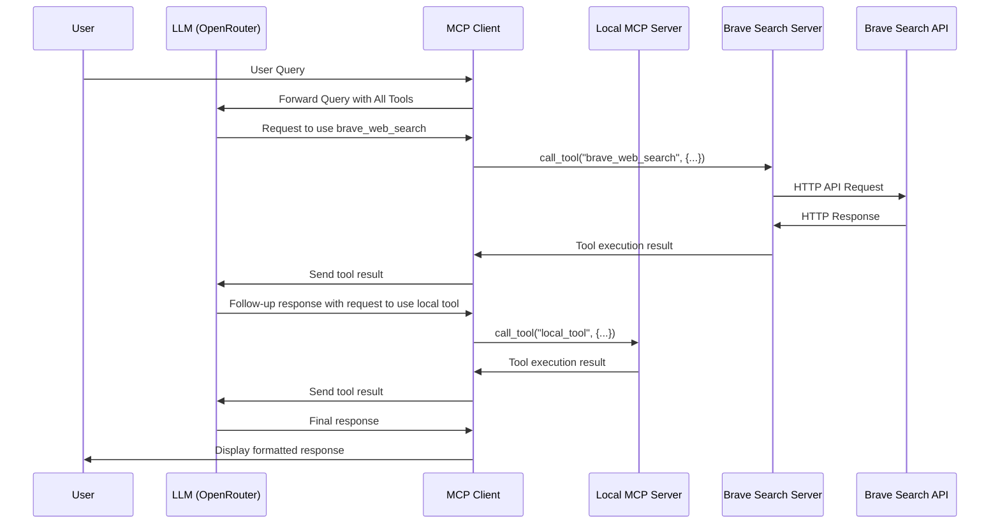

# MCP Client - Advanced Multi-Server Architecture

An advanced, modular client for interacting with Model Context Protocol (MCP) servers using OpenRouter's LLM API services. This project demonstrates a sophisticated approach to AI tool integration using direct client-to-multiple-servers communication.

## Key Features

- **Multiple Server Integration**: Connect to both local and remote MCP servers simultaneously
- **Direct Server Access**: Client connects directly to each specialized server
- **Unified Tool Interface**: Present tools from all servers to the LLM with clear server attribution
- **API Independence**: No direct API dependencies in core code - all external APIs are handled through MCP servers
- **Modular Architecture**: Clean separation between client, LLM integration, and tool management

## Architecture Overview

This project implements an advanced MCP architecture pattern that allows one client to connect to multiple specialized MCP servers simultaneously:

```
                          ┌───────────────────────┐
                     ┌───►│  Local MCP Server     │
                     │    │  (Math, Health tools) │
                     │    └───────────────────────┘
┌─────────────┐      │    
│             │      │    ┌───────────────────────┐       ┌─────────────┐
│  LLM Client ├──────┼───►│  Brave Search Server  │──────►│  Brave API  │
│ (OpenRouter)│      │    │                       │       │             │
│             │      │    └───────────────────────┘       └─────────────┘
└─────────────┘      │    
                     │    ┌───────────────────────┐
                     └───►│  Other MCP Servers    │
                          │  (As needed)          │
                          └───────────────────────┘
```

### Components

1. **Client Components**
   - `main.py`: Entry point for the application
   - `src/client/mcp_client.py`: Main client for interacting with MCP servers
   - `src/client/llm_client.py`: Client for communicating with the OpenRouter API
   - `src/client/tool_manager.py`: Manages tool operations and formatting
   - `src/utils/logger_setup.py`: Configures logging for the application

2. **Server Components**
   - `server/main.py`: Entry point for the local MCP server
   - `server/tools/`: Directory containing tool implementations
   - `server/resources/`: Directory containing resource implementations
   - `server/prompts/`: Directory for prompt templates
   - `server/utils/`: Utility functions shared across modules

3. **External MCP Servers**
   - `@modelcontextprotocol/server-brave-search`: Official Brave Search MCP server
   - Additional servers as needed (defined in `server_config.json`)

## Multi-Server Client Architecture

The client intelligently manages connections to multiple MCP servers and routes tool calls to the appropriate server:

```
┌───────────────────────────────────────────────────────────────────────────────────────┐
│                                                                                       │
│                                   MCP Client                                          │
│                                                                                       │
│  ┌────────────────┐  ┌─────────────────┐  ┌────────────────────┐  ┌──────────────┐   │
│  │                │  │                 │  │                    │  │              │   │
│  │ Session Router │  │ Tool Collection │  │ Server Connections │  │ LLM Client   │   │
│  │                │  │                 │  │                    │  │              │   │
│  └────────────────┘  └─────────────────┘  └────────────────────┘  └──────────────┘   │
│                                                                                       │
└───────┬───────────────────────┬────────────────────────┬───────────────────────┬─────┘
        │                       │                        │                       │
        ▼                       ▼                        ▼                       ▼
┌─────────────────┐    ┌─────────────────┐    ┌─────────────────┐     ┌─────────────────┐
│                 │    │                 │    │                 │     │                 │
│ Local Server    │    │ Brave Search    │    │ Other Server    │     │    OpenRouter   │
│ (MCP Protocol)  │    │ (MCP Protocol)  │    │ (MCP Protocol)  │     │    LLM API      │
│                 │    │                 │    │                 │     │                 │
└─────────────────┘    └─────────────────┘    └─────────────────┘     └─────────────────┘
```

## Setup

1. **Install dependencies**:
   ```bash
   pip install -r requirements.txt
   ```

2. **Create a `.env` file** with your API keys:
   ```
   OPENROUTER_API_KEY=your-openrouter-api-key
   BRAVE_API_KEY=your-brave-api-key
   DEFAULT_LLM_MODEL=google/gemini-2.0-flash-001
   ```

3. **Ensure NPX is installed** (for external MCP servers):
   ```bash
   # Check if npx is installed
   npx --version
   
   # If not, install Node.js which includes npx
   # On Ubuntu/Debian:
   sudo apt update && sudo apt install nodejs npm
   ```

## Usage

### Connecting to Multiple Servers

The most powerful setup is to connect to multiple servers simultaneously:

```bash
# Connect to both your local server and the Brave Search server
python main.py server/main.py --server brave-search
```

### Connecting to Individual Servers

You can also connect to servers individually:

```bash
# Connect only to your local server
python main.py server/main.py

# Connect only to the Brave Search server
python main.py --server brave-search
```

### Connecting to Multiple External Servers

Connect to multiple external configured servers:

```bash
# Connect to multiple configured servers
python main.py --server brave-search --server another-server
```

## Client-to-Multiple-Servers Communication

Unlike server-to-server communication (which has concurrency issues), this implementation has the client maintain separate connections to each server and route tool calls appropriately:



## Tool Categories

The various servers provide the following tools:

1. **Local Server Tools**:
   - **Math Operations**:
     - `add`: Adds two numbers
     - `multiply`: Multiplies two numbers
   - **Health Calculations**:
     - `calculate_bmi`: Calculates BMI from weight (kg) and height (m)
   - **External Data**:
     - `fetch_weather`: Fetches weather information for a location based on coordinates
     - `fetch_next_three_fixtures`: Fetches upcoming football fixtures

2. **Brave Search Server Tools**:
   - `brave_web_search`: Performs web searches
   - `brave_local_search`: Searches for local businesses

## Example Interaction

Here's an example of using tools from multiple servers:

```
Query: Can you find information about AVFC's upcoming fixtures and then search for news about their latest signing?

I'll help you find information about Aston Villa FC's upcoming fixtures and then search for news about their latest signing.

[Calling tool fetch_next_three_fixtures from main server with args {"league_id": 39, "season": 2024, "team_id": 66}]
Tool result: 15 Mar 2025, 15:00: Aston Villa vs Crystal Palace at Villa Park
22 Mar 2025, 15:00: Manchester City vs Aston Villa at Etihad Stadium
02 Apr 2025, 20:00: Aston Villa vs Newcastle at Villa Park

[Calling tool brave_web_search from brave-search server with args {"query": "Aston Villa FC latest signing 2025"}]
Tool result: (News search results about Aston Villa's latest signing)

Based on the information I found, Aston Villa's upcoming fixtures are:

1. March 15, 2025, 15:00: Aston Villa vs Crystal Palace at Villa Park
2. March 22, 2025, 15:00: Manchester City vs Aston Villa at Etihad Stadium
3. April 2, 2025, 20:00: Aston Villa vs Newcastle at Villa Park

Regarding their latest signing, according to recent news, Aston Villa has signed [Player Name] from [Previous Club] for approximately £[Amount]m. The [Position] player has signed a [Duration] contract and is expected to strengthen the team's [Area] ahead of these important fixtures.
```

## Server Configuration

External MCP servers are defined in `server_config.json`:

```json
{
  "brave-search": {
    "command": "npx",
    "args": ["-y", "@modelcontextprotocol/server-brave-search"],
    "env": {
      "BRAVE_API_KEY": "${BRAVE_API_KEY}"
    }
  },
  "another-server": {
    "command": "path/to/server",
    "args": ["--option", "value"],
    "env": {
      "SOME_API_KEY": "your-api-key-here"
    }
  }
}
```

## Adding New Tools

You can extend the server with additional tools by:

1. Adding new tool modules in the `server/tools/` directory
2. Creating new resource modules in the `server/resources/` directory
3. Implementing registration functions for your new components
4. Updating the appropriate `__init__.py` file to import and register your components

Example tool module:

```python
"""Example tool module for the MCP server."""
from mcp.server.fastmcp import FastMCP

def register_example_tools(mcp: FastMCP) -> None:
    """Register all example tools with the MCP server."""
    
    @mcp.tool()
    def example_tool(param1: str, param2: int) -> str:
        """
        Example tool description
        
        Parameters:
        -----------
        param1 : str
            Description of param1
        param2 : int
            Description of param2
            
        Returns:
        --------
        str
            Description of return value
        """
        return f"Result: {param1} - {param2}"
```

## Adding New Servers

To add a new server to the configuration:

1. Create a new entry in `server_config.json`:
   ```json
   "my-new-server": {
     "command": "your-command",
     "args": ["--arg1", "value1"],
     "env": {
       "API_KEY": "your-api-key"
     }
   }
   ```

2. Connect to it along with other servers:
   ```bash
   python main.py server/main.py --server my-new-server --server brave-search
   ```

## Debugging

Detailed logging is provided for debugging and development. The logs include:

- Tool execution details
- Server connection information
- LLM API requests and responses
- Error details with stack traces

To view more detailed logs, set the logging level to DEBUG in `src/utils/logger_setup.py`.

## Advanced MCP Features

This project demonstrates several advanced MCP features:

1. **Client-to-Multiple-Servers Communication**: Connecting to and using tools from multiple specialized servers
2. **Dynamic Tool Discovery**: Collecting tools from multiple servers with server attribution
3. **Tool Routing**: Correctly routing tool calls to the appropriate server
4. **Environment Variable Management**: Properly handling environment variables for servers

## Future Enhancements

Planned enhancements for this project include:

1. **Tool Authorization**: Adding authorization controls for external tools
2. **Caching Layer**: Implementing caching for server responses
3. **Tool Pipelines**: Creating pipelines of tools across multiple servers
4. **Prompt Templates**: Adding support for MCP prompt templates
5. **Resource Integration**: Better integration of MCP resources

## Contributors

- [Henry Pugh](https://github.com/henrypugh)